# Translate-It

[Online demo](https://kshashov.github.io/translate-it)

## Summary

This is a frontend part of the app. The backend code is located in the [repo](https://github.com/kshashov/Translates-Api).

The application is a simple analog of [writing section of Puzzle English](https://puzzle-english.com/writing/verb-tenses).

The main entities here are multi-phrase exercises. Users are supposed to solve these exercises by gradually translating each phrase from the source language to the target language.

Users with the required permissions can modify other's user roles, solve, create, modify and delete exercises.

### Technologies
* VueJS
    * Vuetify
    * Vuelidate
* CASL
* Axios

### CI/CD
* **GitHub Pages** - deploying to [https://kshashov.github.io/translate-it](https://kshashov.github.io/translate-it)

## Pages
### Login
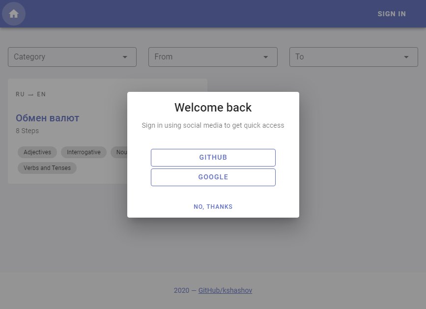
### Exercises
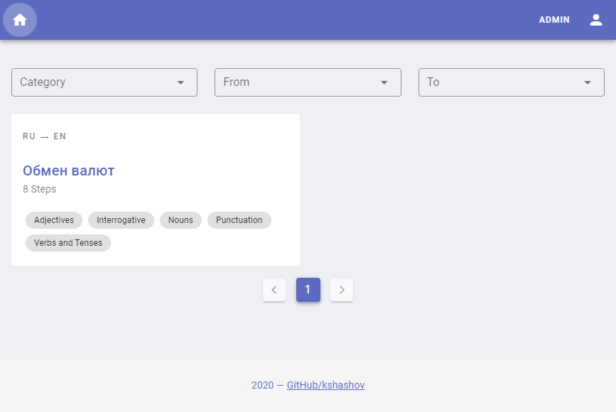
### Exercise
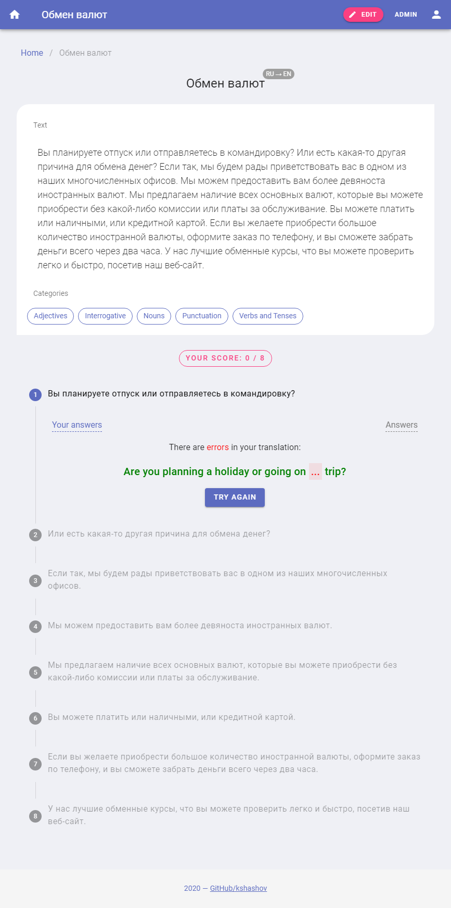
### User Profile
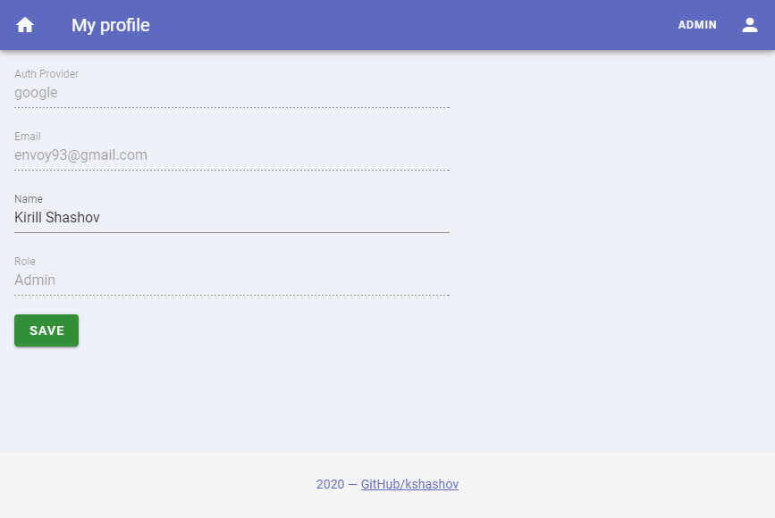
### Users Admin
#### Search
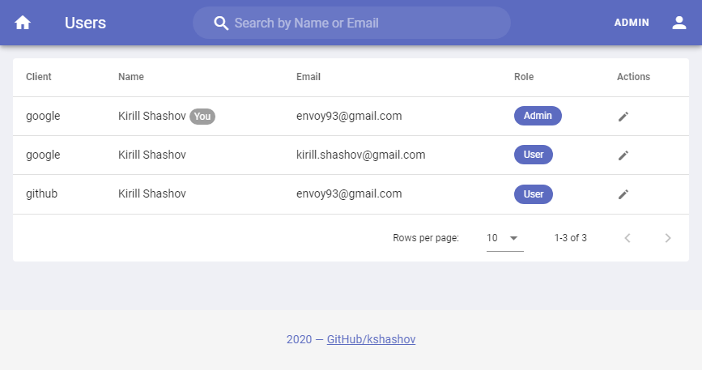
#### Edit
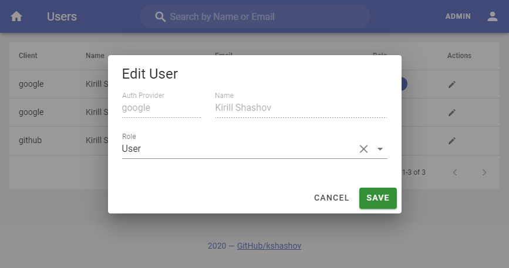
### Exercises Admin
#### Search
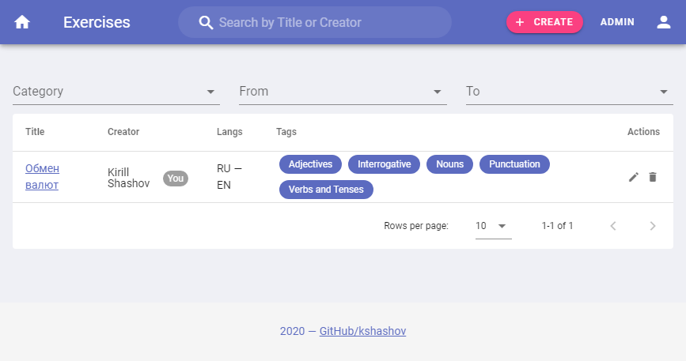
#### Create
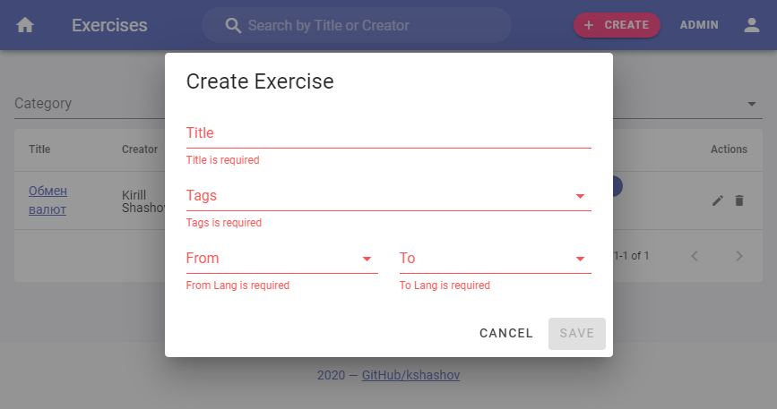
#### Edit
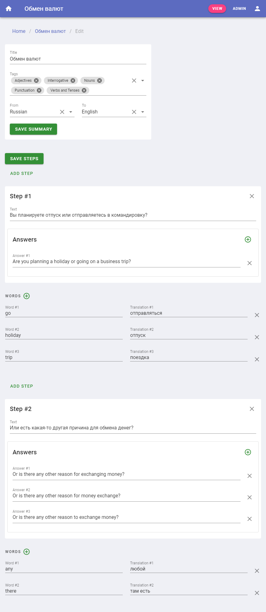
### Security
#### Login
If user is trying to open a non-public page. 
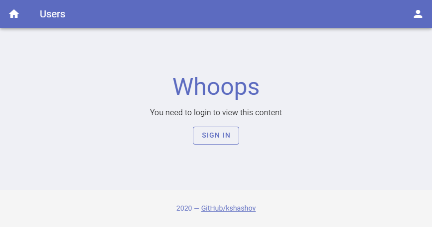
#### Forbidden
If user has no required permissions. 
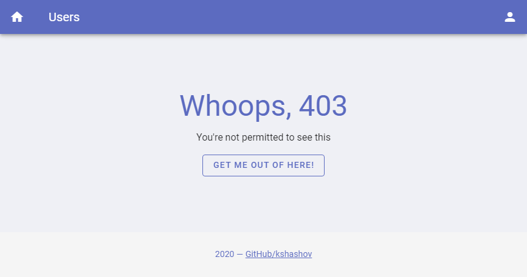

## Project setup
```
npm install
```

### Compiles and hot-reloads for development
```
npm run serve
```

### Compiles and minifies for production
```
npm run build
```

### Lints and fixes files
```
npm run lint
```

### Required environment variables
You can create `.env` file in root of the project and write any variables there.

The app required several variables to work properly:
```dotenv
# Address of the backend server. For example
VUE_APP_TRANSLATES_API_BASE_URL=http://localhost:8084

# Relative path for the frontend location. For example
VUE_APP_TRANSLATES_PUBLIC_PATH=/
```

In case the `VUE_APP_TRANSLATES_PUBLIC_PATH` path is `/`, the `history` router mode is used, otherwise the `hash`. 
